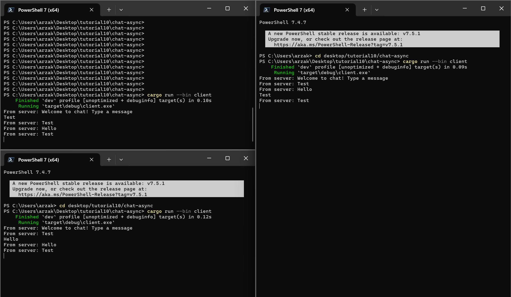

# Tutorial 10 - Broadcast Chat

Cara mendapatkan hasil di atas adalah dengan menjalankan `server.rs` terlebih dahulu lalu menjalankan 3 buah `client.rs` di tiga terminal yang berbeda. Saat dijalankan, server mendengarkan ke port 200 dan setiap kali ada `client.rs` yang dijalankan, maka dari sisi server akan ada sebuah notifikasi bahwa ada koneksi baru dari port sekian. Ketika suatu client mengetik pesan dalam terminal dan mengirimkannya, maka server akan menangkap dan print 'from client .... "..."' dan di semua klien akan mendapatkan sebuah pesan dari server yakni berupa 'From Server: "..."'.