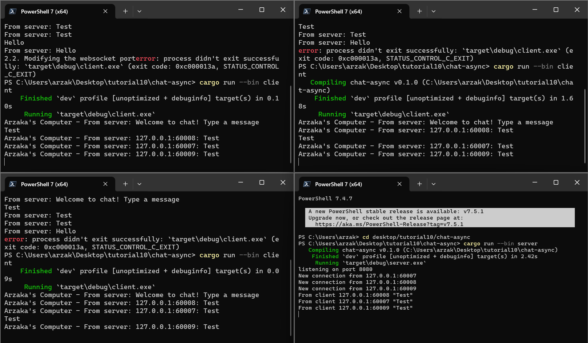

# Tutorial 10 - Broadcast Chat

### 2.1. Original code of broadcast chat

Cara mendapatkan hasil di atas adalah dengan menjalankan `server.rs` terlebih dahulu lalu menjalankan 3 buah `client.rs` di tiga terminal yang berbeda. Saat dijalankan, server mendengarkan ke port 200 dan setiap kali ada `client.rs` yang dijalankan, maka dari sisi server akan ada sebuah notifikasi bahwa ada koneksi baru dari port sekian. Ketika suatu client mengetik pesan dalam terminal dan mengirimkannya, maka server akan menangkap dan print 'from client .... "..."' dan di semua klien akan mendapatkan sebuah pesan dari server yakni berupa 'From Server: "..."'.

### 2.2. Modifying the websocket port

Jika websocket port untuk server diubah dari port 2000 ke port 8080, maka client tidak lagi terhubung kepada server karena client mengirimkan pesan tetap ke dalam port 2000. Jika hal ini dipaksakan untuk dilakukan, maka akna terjadi error `access is denied` karena client memaksa untuk mengirim pesan ke port yang tidak dikenal (bukan server). Jika ingin tetap bekerja, maka websocket port untuk client juga harus diubah dari port 2000 ke port 8080 juga agar dapat mengirimkan pesan ke port yang sama dengan server. Dengan ini, pengiriman dan penerimaan pesan tetap berjalan secara lancar.

### 2.3. Small changes. Add some information to client

Pada code server seperti biasanya, saya mengirimkan "Welcome to chat! Type a message" untuk pendahuluan kepada client, setelah itu saya mengubah tampilan jika seorang client mengirimkan pesan yakni dengan menampilkan IP dan Port dari client tersebut. Sementara dalam code client saya menambahkan `println!("Arzaka's Computer - From server: {}", text);` yang memodifikasi pesan yang dikirimkan dari server ke client yakni dengan tambahan "Arzaka's Computer" di depannya.